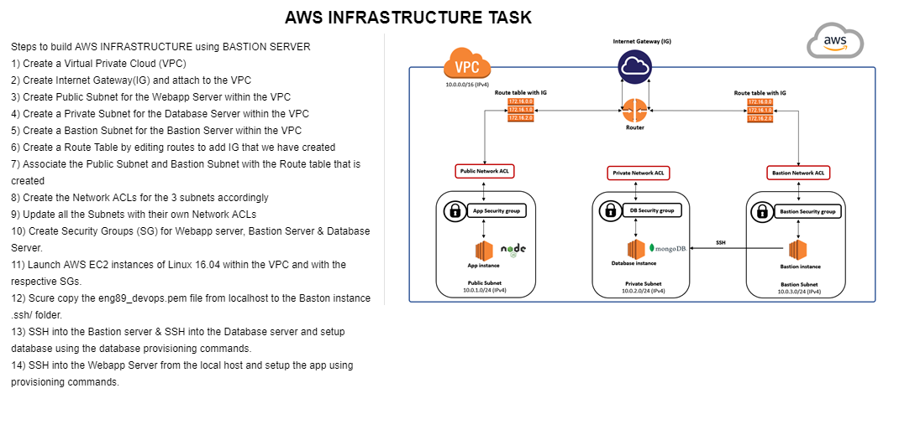

# Creating AWS INFRASTRUCTURE using Virtual Private Cloud on AWS along with BASTION SERVER

## Steps:
- Create a VPC 'eng89_infra_prathima_vpc' with CIDR 10.210.0.0/16
- Create an Internet Gateway 'eng89_infra_prathima_ig' and attach our VPC created.
- Create three subnets using the our VPC 1) eng89_infra_prathima_subnet_public(IPv4 = 10.21.1.0/24) for webapp server, 2) eng89_infra_prathima_subnet_private(IPv4 = 10.21.2.0/24) for the database server, 3) eng89_infra_prathima_subnet_bastion(IPv4 = 10.210.3.24) by choosing the same 'Ireland/eu-west-1a' as the Availability Zone. 
- Create Route Table 'eng89_infra_prathima_route_internet' and attach our VPC.
 - Edit the routes by adding rule Destination: 0.0.0.0/0 and Target: Internet Gateway that is created. 

 - Open all the three subnets and Edit the route table association to the one we have just created.

### Create Network ACLs 
- Create the public Network ACL as 'eng89_infra_prathima_nacl_public' and update the Subnet Associations with 'eng89_infra_prathima_subnet_public'
  * Edit Inbound rules
  ```
  Role number: 100, Type: HTTP(80), port: 80, Source: 0.0.0.0/0
  Role number: 110, Type: SSH(20), port: 22, Source: x.x.x.x/32 (MyIP)
  Role number: 120, Type: Custom TCP, port: 1024-65535, Source: 0.0.0.0/0
  Role number: 130, Type: HTTPS(443), port: 443, Source: 0.0.0.0/0
  ```
 * Edit Outbound rules
 ```
  Role number: 100, Type: HTTP(80), port: 80, Source: 0.0.0.0/0
  Role number: 110, Type: Custom TCP, port: 27017, Source: 10.210.2.0/24 (webapp)
  Role number: 120, Type: Custom TCP, port: 1024-65535, Source: 0.0.0.0/0
  Role number: 130, Type: HTTPS(443), port: 443, Source: 0.0.0.0/0
 ```
- Create the private Network ACL as 'eng89_infra_prathima_nacl_private' and update the Subnet Associations with 'eng89_infra_prathima_subnet_private'
  * Edit Inbound rules
  ```
  Role number: 100, Type: SSH(22), port: 22, Source: 10.210.3.0/32 (for Bastion server)
  Role number: 110, Type: Custom TCP, port: 27017, Source: 0.0.0.0/0
  Role number: 120, Type: Custom TCP, port: 1024-65535, Source: 0.0.0.0/0
  Role number: 130, Type: HTTP(80), port: 80, Source: 0.0.0.0/0
  Role number: 140, Type: HTTPS(443), port: 443, Source: 0.0.0.0/0
  ```
 * Edit Outbound rules
 ```
  Role number: 100, Type: HTTP, port: 80, Source: 0.0.0.0/0
  Role number: 110, Type: Custom TCP, port: 1024-65535, Source: 10.210.1.0/24 (webapp server)
  Role number: 120, Type: Custom TCP, port: 1024-65535, Source: 10.210.3.0/24 (bastion server)
 ```
#### Create the bastion Network ACL as 'eng89_infra_prathima_nacl_bastion' and update the Subnet Associations with 'eng89_infra_prathima_subnet_bastion'
  * Edit Inbound rules
  ```
  Role number: 100, Type: SSH(22), port: 22, Source: 0.0.0.0/0 
  Role number: 110, Type: Custom TCP, port: 1024-65535, Source: 10.210.2.0/24 (database server)
  ```
 * Edit Outbound rules
 ```
  Role number: 100, Type: SSH(22), port: 22, Source: 10.210.2.0/24 (webapp server)
  Role number: 110, Type: Custom TCP, port: 1024-65535, Source: 0.0.0.0/0
 ```

- Create Security Group for the webapp server as 'eng89_infra_prathima_SG_app' and connect to the VPC that is created.
 * Edit the inbound rules 
 ```
 'Type:SSH, Port:22, Source: MyIP: x.x.x.x/32'
 'Type:HTTP, Port:80, Source: Anywhere: 0.0.0.0/0'
 ```

- Create Security Group for the database 'eng89_infra_prathima_SG_db' and connect to the VPC that is created.
 * Edit the inbound rules 
 ```
 Type:SSH, Port:22, Source: Custom: eng89_infra_prathima_SG_bastion
 Type:HTTP, Port:80, Source: Custom: eng89_infra_prathima_SG_app
```
* Outbound rules as default

### Launch EC2 instances for webapp, database, and bastion servers as below:
 - Create webapp server instance of 'ubuntu16.04' AMI as 'eng89_infra_prathima_webapp_server' using 'eng89_infra_prathima_vpc', 'eng89_infra_prathima_subnet_public' and 'eng89_infra_prathima_SG_app'
 - Create database server instance of 'ubuntu16.04' as 'eng89_infra_prathima_db_server' using 'eng89_infra_prathima_vpc', 'eng89_infra_prathima_subnet_private' and 'eng89_infra_prathima_SG_db'
 - Create bastion server instance of 'ubuntu16.04' as 'eng89_infra_prathima_bastion_server' using 'eng89_infra_prathima_vpc', 'eng89_infra_prathima_subnet_bastion' and 'eng89_infra_prathima_SG_bastion'

### From the git bash:

#### To setup up database server, copy the eng89-devops.pem key from local machine/.ssh folder into bastion server/.ssh/ folder and ssh into the bastion server as below:
```
scp -i eng89_devops.pem -r eng89_devops.pem bastion-machinename:~/.ssh/
ssh -i eng89_devops.pem ubuntu:bastion_machine
```
#### Now we are inside the Bastion server instance, we need to go inside .ssh folder and ssh into database server as below:
```
cd .ssh
chmod 400 eng89_devops.pem
ssh -i eng89_devops.pem ubuntu:database_machine
```
#### Now we are inside database_server, run all the below commands to setup and run the mongodb:
``` 
sudo apt-key adv --keyserver hkp://keyserver.ubuntu.com:80 --recv D68FA50FEA312927
echo "deb https://repo.mongodb.org/apt/ubuntu xenial/mongodb-org/3.2 multiverse" | sudo tee /etc/apt/sources.list.d/mongodb-org-3.2.list
sudo apt-get update -y
sudo apt-get upgrade -y
sudo apt-get install mongodb-org=3.2.20 -y
sudo apt-get install -y mongodb-org=3.2.20 mongodb-org-server=3.2.20 mongodb-org-shell=3.2.20 mongodb-org-mongos=3.2.20 mongodb-org-tools=3.2.20

sudo nano etc/mongod.conf
net:
  port: 27017
  bindIp: 0.0.0.0

sudo systemctl restart mongod
sudo systemctl enable mongod #optional
sudo systemctl status mongod #optional
```

#### To setup webapp server, copy the 'app' from local machine into the 'webapp_server' instance and ssh into the 'eng89_infra_prathima_webapp_server' and run all the provisioning commands one after other as below:

```
cd etc/nginx/sites-available
rm -rf default
sudo nano default
server{
       listen 80;
       server_name _;
       location / {
       proxy_pass http://10.210.1.48:3000/;   # This is webapp private IP
       }
       location /posts {
       proxy_pass http://10.210.1.48:3000/posts;
       }
   }

cd 
sudo echo 'export DB_HOST=mongodb://10.210.2.35:27017/posts' >> .bashrc
source ~/.bashrc  # to store env variable permanently

sudo apt-get update -y
sudo apt-get upgrade -y
sudo apt-get install nginx -y
sudo apt-get install git -y
sudo apt-get install python-software-properties -y
curl -sL https://deb.nodesource.com/setup_12.x | sudo -E bash -
sudo apt-get install nodejs -y
sudo npm install pm2 -g
sudo systemctl restart nginx
sudo systemctl enable nginx 
cd app
npm install
node app.js (or npm start)
```

### VPC is all setup and can share the webapp server's public IP to view app running globally and safely

